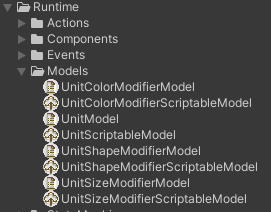

#Architecture
The project architecture is based on ECA (Entity, Component, Action)
on the AppCore framework.

##Entity
Contains a graph of Components, Actions and connections between them.
 

##Component
Stores data and provides access to it.
Monitors the integrity and consistency of data.
It also protects the component invariant from incorrect states.
 

##Action
Contains the business logic of processing component data.
 

#Дополнительня механника
Implemented the mechanics of Drag and Merge units, as one of the most relevant mechanics.
 

#Game Architecture
##State Machine
Assets/App/ArmyClash/Runtime/StateMachines
 
Controls the Core Loop of the game,
loading data models and transitions between states.
 

##Components
Assets/App/ArmyClash/Runtime/Components
 

##Actions
Assets/App/ArmyClash/Runtime/Actions
 

##Модели данных
Assets/App/ArmyClash/Runtime/Models
 

 
Implements the logic of storing data models in ScriptableObject.
Allows to save and load data models from the file system.

##Resources
### Event Buses

###Pools

###Settings

###Storable Data Models

#Issues
##Characteristic issue
In original description Small Green Sphere Unit starts with zero health.
Change Basic Unit Characteristics: 100HP to 150HP

##Feeling issue
Create alternative Target Searching and Movement.
In my opinion this add more battle feeling.
 
Assets/App/ArmyClash/Scenes/Main Scene Alternative Target Search

##Performance issue
Target Search System and Movement System are simplified non-parallel systems.
When there will be a lot of Unit, it may cause performance reduction.
The solution: create parallel Job Systems with fake physics.