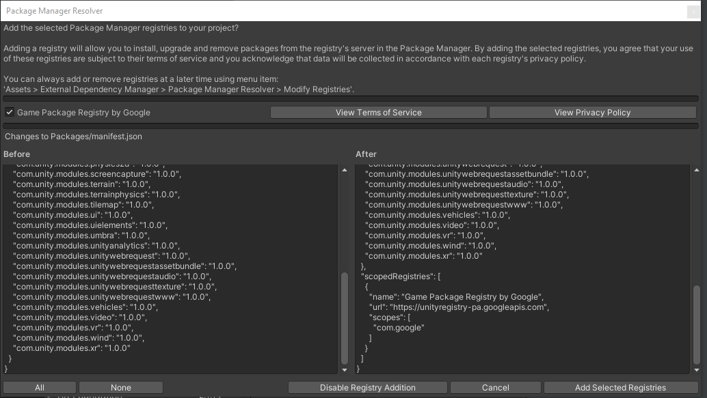
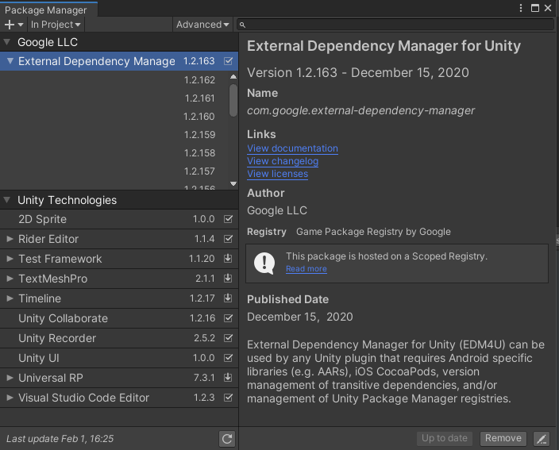
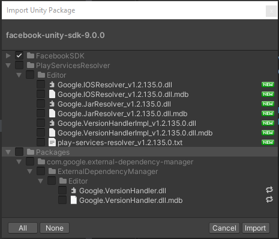
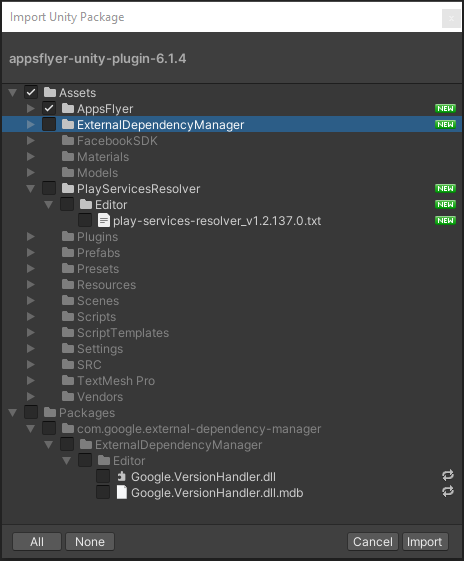
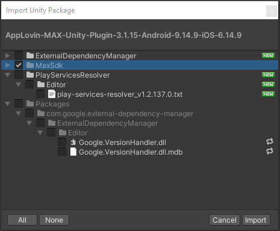

# General Information
Vendor: Krem
 
Package Name: AzureAnalytics
 
Author: Sergey Liuminarskiy <theprideme@gmail.com>
 
Use package with Unity 2020.3.25 or Later
 
Use Core Version: 0.11.2
  
Package create for fast and simple integration in game Azure Game SDK stack: 
- Facebook SDK
- AppsFlyer SDK
- AppMetrica SDK
- AppLovin Max SDK

Package contains event actions for support Azure Guidelines
 
https://docs.google.com/spreadsheets/d/1eeU46jdKNCtpG7DHX3XqxndS9ZLtGneeM5unIONBffQ/edit#gid=0
 
And actions for Ads placement

# Prepare for Use
Import external-dependency-manager-1.2.158
and add selected registries
 

Update External Dependency Manager to Latest version (Currently worked on 1.2.163)
 

 
 
 

#### IMPORTANT!
#### AFTER IMPORT External Dependency Manager FROM GOOGLE REGISTRY
#### DO NOT IMPORT IT FROM OTHER SDK AND PACKAGES
 
 
 

## Import and setup Facebook

Download latest facebook sdk version (currently worked on 9.0.0)
 
https://developers.facebook.com/docs/unity/

Import Facebook sdk
 
**BE SURE TO DISCARD FOR IMPORT PlayServiceResolver AND External Dependency Manager
from facebook sdk. because it already installed from google official repository**
 

Disable Android Auto Resolution if that window has appear after import facebook sdk

After that setup all facebook settings: 
Facebook > Edit Settings

## Import and setup AppsFlyer

Download latest version of AppsFlyer SDK (currently worked on 6.1.4) 
https://github.com/AppsFlyerSDK/appsflyer-unity-plugin
 
**BE SURE TO DISCARD FOR IMPORT PlayServiceResolver AND External Dependency Manager**
 

## Import and setup AppMetrica
Download latest version of AppMetrica SDK (currently worked on 3.7.0) 
https://appmetrica.yandex.ru/docs/mobile-sdk-dg/concepts/unity-plugin.html

## Import and setup AppLovin MaxSDK
Download latest version of AppLovin Max SDK (Currently worked on 3.2.3)
 
**BE SURE TO DISCARD FOR IMPORT PlayServiceResolver AND External Dependency Manager**
 

# Cleanup

## Android resolver
Delete all files in folder Plugins/Android
 
Assets > External Dependency Manager > Android Resolver > Delete Resolved Libraries
 
Assets > External Dependency Manager > Android Resolver > Force Resolve